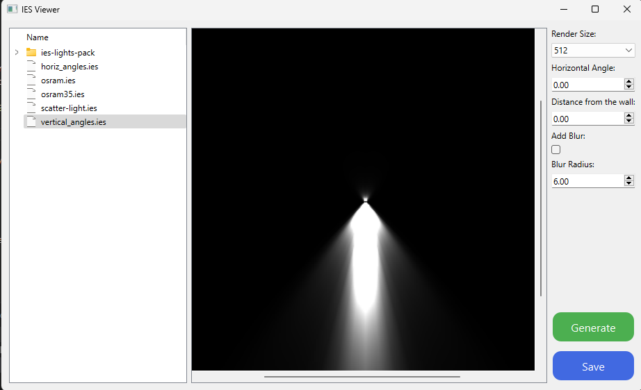

# IES Parser and Renderer

## Overview

A module designed to parse photometric data from IES files and render corresponding light patterns. It aims to assist designers and engineers in visualizing and analyzing lighting specifications in a 3D environment.

## Features

- **IES Parsing:** Seamlessly reads IES files, extracting and structuring data into an accessible `IESData` namedtuple It handles handles horizontal and vertical angles along with their corresponding Candela values.
- **IES Render:** Generate preview images of lights positioned at mutable distances against a wall. Render is returned as `PIL.Image` instances, with options to save directly.

## Getting Started

### Prerequisites

- Python 3.9+
- Pillow 10.0.1
- PySide2/6 or PyQt4/5
- [QtPy 2.4.0](https://github.com/spyder-ide/qtpy)

### Installation

Provide clear steps about how to install and set up your project.

```bash
git clone https://github.com/michaellevin/ies-render.git
cd ies-render
pip install -r requirements.txt
```

### Usage

```py
import IES_Thumbnail_Generator
image = IES_Thumbnail_Generator('path/to/light.ies').render(
            size=512,
            horizontal_angle=0.0,
            distance=0.0,
            blur_radius=1.0,
            save=True,
            out_path='path/to/light.jpg',
        )
# Return a PIL.Image instance 
```

### IES Format Documentation
The format description and a simpleistic Houdini setup scene explaining is store in [docs folder](docs)